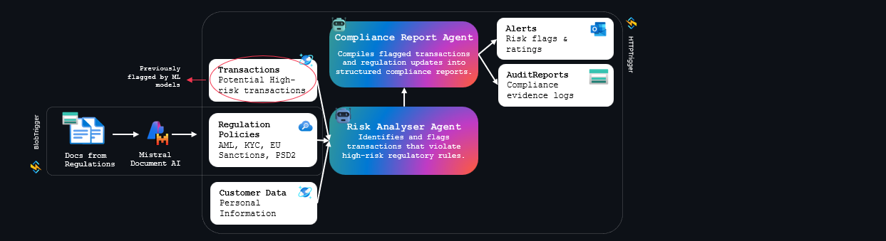

# Azure Trust and Compliance Multi-Agents Hack 🤖

Welcome to the Automated Compliance Agents Hackathon! 🏦 Today, you'll dive into the world of intelligent agent systems powered by Azure AI to revolutionize regulatory compliance in financial services. Get ready for a hands-on, high-impact day of learning and innovation!

## Introduction 

Get ready to transform compliance with AI! In this hackathon, you'll build intelligent agents that parse regulations, monitor transactions, and generate transparent audit trails—just like real compliance teams. From reading new laws to flagging suspicious activity, your agents will collaborate to automate complex regulatory workflows in minutes, not months. By the end, you'll have created a powerful multi-agent system that redefines how financial institutions stay compliant and build trust. 

## Learning Objectives 🎯

By participating in this hackathon, you will learn how to:

- **Build Intelligent Compliance Systems** using Azure AI Foundry and GPT-4o-mini to extract and analyze data from complex financial regulations and transaction documents.
- **Develop Specialized Agents** (e.g., Regulation Parser, Risk Scorer, Audit Reporter) with advanced prompt engineering and tool integration.
- **Extend Agent Capabilities** using Azure API Management (APIM) and Model Context Protocol (MCP) servers to connect agents with external compliance systems and tools.
- **Implement Persistent Memory** with Azure Cosmos DB to enable agents to maintain context, build audit trails, and learn from historical compliance decisions.
- **Monitor and Evaluate Agents** using Azure AI Foundry, GitHub Actions, and observability tools for performance, safety, and responsible AI practices in production environments.

## Data Flow 🔄

This project implements an end-to-end AI-driven compliance monitoring workflow. Regulatory documents (PDFs, PPTX, images) are ingested and processed with Mistral Document AI to extract and interpret policies such as AML, KYC, EU Sanctions, and PSD2. Instead of monitoring every transaction, the workflow is triggered only when a machine learning model flags a transaction as high risk. These high-risk records are then analyzed by the Risk Agent Analyser, which evaluates them against regulatory requirements and sensitive customer data to detect potential compliance breaches. The findings are passed to the Compliance Report Agent, which generates structured outputs:

- Alerts – real-time risk flags and ratings
- Audit Reports – compliance evidence logs for audits and regulatory checks

The pipeline is automated with BlobTrigger and HTTPTrigger, ensuring continuous monitoring of flagged events, rapid response to high-risk activities, and robust compliance reporting.

## Architecture 🏗️
WIP

## Requirements 📋
To successfully complete this hackathon, you will need the following:

- GitHub account to access the repository and run GitHub Codespaces and Github Copilot. 
- Be familiar with Python programming, including handling JSON data and making API calls.​ 
- Be familiar with Generative AI Solutions and Azure  Services. 
- An active Azure subscription, with Owner rights. 
- Ability to provision resources in **Sweden Central** or [another supported region](https://learn.microsoft.com/en-us/azure/ai-foundry/openai/concepts/models?tabs=global-standard%2Cstandard-chat-completions#global-standard-model-availability). 

## Challenges 🚩

- Challenge 00: **[Environment Setup & Azure Resource Deployment](challenge-0/readme.md)** : Resource Deployment, Github Codespaces + .env Variables + Data Ingestion
- Challenge 01: **[Create your Agents](challenge-1/readme.md)** : Creation of the Blob trigger function- 30mn
- Challenge 02: **[Extend your Agents](challenge-2/readme.md)** : Creation of the 2 agents and orchestration (risk analyser and compliance report agent)
- Challenge 03: **[Use your Memory | Cosmos DB ](challenge-3/readme.md)** : Build your API for the trigger
- Challenge 04: **[Gain peace of mind](challenge-4/readme.md)** : APIM + Security
- Challenge 05: **[Gain peace of mind](challenge-4/readme.md)** : MmeoryResponsible AI (Evaluation with GH Actions, Observability, Safety)