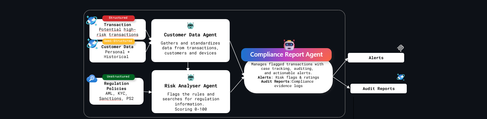

# Challenge 1: Agent Framework Agents for Fraud Detection 🤖

**Expected Duration:** 60 minutes

## Understanding the Microsoft Agent Framework

The [**Microsoft Agent Framework**](https://learn.microsoft.com/en-us/agent-framework/overview/agent-framework-overview) is an open-source SDK and runtime that empowers developers to build, orchestrate, and deploy sophisticated AI agents and multi-agent workflows in Python or .NET. It combines robust enterprise-ready foundations (from Semantic Kernel) with innovative orchestration patterns (from AutoGen) for reliability and flexibility in both experimental and production contexts.

**Key Features**:
- **Multi-language support:** Build agents in .NET (C#) or Python.
- **Graph-based workflows:** Connect agents and deterministic functions using intelligent data flows. Enable streaming, checkpointing, and human-in-the-loop scenarios.
- **Open standards:** Built-in support for MCP (Model Context Protocol), A2A (Agent-to-Agent messaging), and OpenAPI-first agent tool integration.
- **Advanced memory:** Pluggable, adaptive memory solutions—supporting persistent, in-memory, and external vector stores.
- **Observability:** Native OpenTelemetry integration for monitoring and debugging workflows.
- **Interoperability:** Cloud-agnostic runtime; deploy agents across clouds, on-premises, or containers.

As an improved version from previous orchestration frameworks, guidance has been created for migration from [Semantic Kernel](https://learn.microsoft.com/en-us/agent-framework/migration-guide/from-semantic-kernel/?pivots=programming-language-python) and [Autogen](https://learn.microsoft.com/en-us/agent-framework/migration-guide/from-autogen/).


## Today's Use Case

Today's project presents a multi-agent compliance **automation workflow** aimed at optimizing financial risk and regulatory oversight. The solution features a modular architecture where a Customer Data Agent collects and standardizes information from transactions, customers, and devices, drawing on both structured transactional data and semi-structured customer histories. Simultaneously, a Risk Analyser Agent ingests unstructured regulation policies—including AML, KYC, sanctions, and PSD2—and flags transactions based on compliance rule scoring. Flagged items are streamlined to a central Compliance Report Agent, which manages case tracking, audit logging, and generates actionable alerts. As final outputs, the system produces risk-based alerts and comprehensive audit reports, enabling robust, transparent compliance operations suited for high-stakes financial environments.



## How are the Agents built?

As you can see on the diagram above, we have 2 agents that are going to provide us with the ability to create a structured approach to start working on the Compliance Auditing Automation:


### Customer Data Agent

Gathers and standardizes data from transactions, customers and devices​

**Available Functions**:
- `get_customer(customer_id)` - Retrieve customer details by ID
- `get_customer_by_country(country)` - Get all customers from specific country  
- `get_transaction(transaction_id)` - Fetch individual transaction details
- `get_transactions_by_customer(customer_id)` - Get all transactions for a customer
- `get_transactions_by_destination(destination_country)` - Get transactions by destination country


### Risk Analyzer Agent

Maps the standardized customer information against existing regulation policies.

**Tools**: Azure AI Search for regulatory compliance lookups

--

Both agents are built using the **Microsoft Agent Framework** pattern:

```
Azure AI Foundry Project
├── AzureAIAgentClient
├── Agent Framework Tools
├── Data Sources
│   ├── Cosmos DB (Customer/Transaction data)
│   └── Azure AI Search (Regulatory knowledge)
└── Authentication (Azure CLI Credential)
```

## Step-by-Step Guide 📋

### Part 1 - Creating 2 simple Azure AI Agents using the Agent Framework

#### Step 1: Explore the Data Ingestion Agent 📥

Let's examine the Customer Data Agent that handles data retrieval and enrichment:

**What you'll find:**

1. **Direct Function Definitions (Lines 25-95)**:
   ```python
   def get_customer(
       customer_id: Annotated[str, Field(description="The unique customer identifier")]
   ) -> dict:
   ```

2. **Cosmos DB Integration (Lines 18-23)**:
   ```python
   cosmos_client = CosmosClient(cosmos_endpoint, cosmos_key)
   database = cosmos_client.get_database_client("FinancialComplianceDB")
   ```

3. **Agent Creation with Tools (Lines 108-133)**:
   ```python
   agent = client.create_agent(
       name="DataIngestionAgent",
       instructions="...",
       tools=[get_customer, get_customer_by_country, ...]
   )
   ```

**Task:** Review the function definitions and notice how they use `Annotated` types and `Field` descriptions for better agent understanding.

#### Step 2: Explore the Risk Analyzer Agent ⚠️

Now let's examine the Risk Analyzer Agent for regulatory compliance:

**Key Components:**

1. **Azure AI Search Integration (Lines 20-27)**:
   ```python
   azure_ai_search_tool = HostedFileSearchTool(
       additional_properties={
           "index_name": "regulations-policies",
           "query_type": "simple",
           "top_k": 5,
       },
   )
   ```

2. **Risk Assessment Instructions (Lines 40-60)**:
   - Defines high-risk countries: NG, IR, RU, KP
   - Sets thresholds for amounts, account age, device trust
   - Specifies output format: risk_score, risk_level, reason

**📝 Task:** Review the agent configuration and notice how it integrates Azure AI Search for regulatory knowledge.

#### Step 3: Run Both Agent Files 🚀

Now let's test both agents by running their files:

**Run the Customer Data Agent:**
```bash
python customer_data_agent.py
```

**Expected Output:**
```
🧪 Testing the agent with a sample query...
✅ Agent response: Customer Analysis for CUST1001:

Customer Details:
- Name: Alice Johnson
- Country: US
- Account Age: 820 days
- Device Trust Score: 0.9 (high trust)
- Past Fraud History: No

Transaction History:
- Total Transactions Retrieved: 1
- Transaction ID: TX1001
- Amount: 5200 USD
- Destination Country: US
```

**Run the Risk Analyzer Agent:**
```bash
python risk_analyser_agent.py
```

**Expected Output:**
```
🧪 Testing the agent with a sample query...
✅ Agent response: Based on the regulatory framework, the main KYC regulations for fraud detection include:

1. Customer Identification Program (CIP) requirements...
2. Beneficial ownership identification...
3. Ongoing monitoring requirements...
```

**📝 Task:** Run both agents and verify they execute successfully without errors.

#### Step 4: Verify Agents in Azure AI Foundry Portal 🌐

Let's confirm both agents appear in the Azure AI Foundry Portal:

**📝 Task:**
1. Open [Azure AI Foundry](https://ai.azure.com/) in your browser
2. Sign in with your Azure credentials
3. Navigate to your project (the name is in your `.env` file)
4. Click **"Agents"** in the left navigation menu
5. You should see both agents listed:
   - **DataIngestionAgent** - Customer and transaction data access
   - **RiskAnalyzerAgent** - Regulatory compliance and risk assessment


### Part 2 - Building the Orchestration

. Explaining workflows and orchestration
. 


