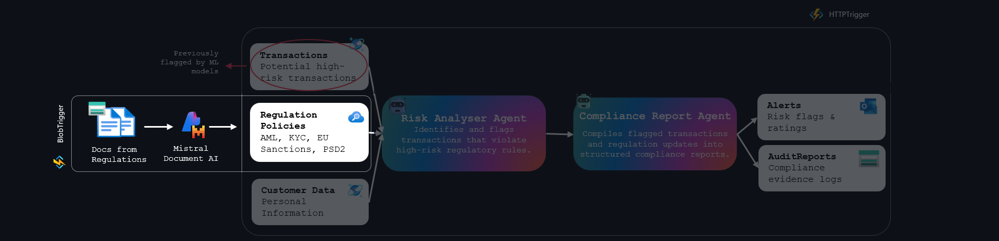

# Challenge 1: Agent Creation & Orchestration 🚦

**Expected Duration:** 60 minutes

## Introduction
This challenge guides you through building a compliance automation system using Azure AI Agent Service and Semantic Kernel. You will create and orchestrate three specialized agents to parse regulations, score transaction risks, and generate audit trails—enabling transparent, real-time compliance for financial institutions.

## What are we building?
In this challenge, we will create 3 specialized agents that form the backbone of our compliance automation and banking AI agent ecosystem:

| Agent                        | Goal                                                      | Datasource                                                                 | Tool                        |
|------------------------------|-----------------------------------------------------------|----------------------------------------------------------------------------|-----------------------------|
| Regulation Parsing Agent     | Extract enforceable rules from regulations and policies    | Regulatory documents, bank policies                                        | Cosmos DB, Azure AI Search |
| Transaction Risk Scoring Agent | Score transactions for risk and compliance in real time   | Live transaction data, rules from Cosmos DB                                | Cosmos DB                 |
| Audit Trail & Explanation Agent | Generate transparent, regulator-ready case files          | Alerts, risk scores, rules from Cosmos DB, citations from AI Search        | Cosmos DB, Azure AI Search |


## Exercise Guide 

### Part 1 - Creation of your Agents

In this part of the challenge, you will create the three agents by implementing and running their respective Python files. You can find the files on the path `challenge-1/agents`

- `regulation_parsing_agent.py`: Extracts and structures rules from regulations and policies.
- `transaction_risk_scoring_agent.py`: Scores transactions for risk and compliance in real time.
- `audit_trail_explanation_agent.py`: Generates transparent, regulator-ready case files.

Each agent will interact with Cosmos DB and/or Azure AI Search as described above.

1. Jump over to the terminal and create your agents by running:

```bash
cd challenge-1/single_agents && python audit-agent.py
```

2. Now go back to your [Azure Foundry Portal](https://ai.azure.com/). You should be able to find the Audit Agent you just created. Please notice how this agent has an ID.

3. Repeat steps `1.` and `2.` for the other 2 agents. 

4. As of this moment, you should have 3 agents created looking like this on the Azure AI Foundry Portal.



5. Go back to your `.env` file address in root and add the following variables with the respective IDs that were just printed:

```bash
AUDIT_AGENT_ID=""
REGULATION_AGENT_ID=""
RISK_SCORING_AGENT_ID=""
```


### Part 2 - Time to Orchestrate!

Orchestration in AI agent systems is the process of coordinating multiple specialized agents to work together on complex tasks that a single agent cannot handle alone. It helps break down problems, delegate work efficiently, and ensure that each part of a workflow is managed by the agent best suited for it. 

Some common Orchestration Patterns are:

| Pattern                  | Simple Description                                                                  |
|--------------------------|------------------------------------------------------------------------------------|
| Sequential Orchestration | Agents handle tasks one after the other in a fixed order, passing results along.   |
| Concurrent Orchestration | Many agents work at the same time on similar or different parts of a task.         |
| Group Chat Orchestration | Agents (and people, if needed) discuss and collaborate in a shared conversation.   |
| Handoff Orchestration    | Each agent works until it can’t continue, then hands off the task to another agent.|
| Magentic Orchestration   | A manager agent plans and assigns tasks on the fly as new needs and solutions arise.|

If you want deeper details into orchestration patterns click on this [link](https://learn.microsoft.com/en-us/azure/architecture/ai-ml/guide/ai-agent-design-patterns?toc=%2Fazure%2Fdeveloper%2Fai%2Ftoc.json&bc=%2Fazure%2Fdeveloper%2Fai%2Fbreadcrumb%2Ftoc.json) to learn more.

Now you might be wondering... ok great... but, **how do I decide on an Orchestration Pattern?** The answer to that question is mostly related to your use case. 

[WIP]

### On orchestration...

**Azure AI Agents with Semantic Kernel integration** offers a more flexible, code-first approach that combines the enterprise-grade capabilities of Azure AI Agent Service with Semantic Kernel's powerful plugin framework. This hybrid approach allows developers to create custom plugins with complex business logic, advanced data processing capabilities, and sophisticated integrations, while still benefiting from Azure's managed infrastructure and security features. 

The Semantic Kernel approach is particularly valuable when you need custom data transformations, complex orchestration patterns, or when integrating with *non-Azure* services.

### A quick recap...

In Part 1, we created the Agents that will be used during our orchestration. Since then, we have added a Meta Prompt to two of the agents and established a direct connection to our search tool for the third agent. As outlined in our Dataflow, the agents will be able to both read from and write to our data sources, enabling us to streamline the entire process end to end.

Next, **we will make the agents more robust**. Specifically, we will create the functions that grant them write capabilities, and we will also develop the Plugins that orchestrate not only writing but also certain reading abilities for our agents.

Here is a comprehensive list of the capabilities we are going to add to our agents: 

Regulation Agent 
- [already has access to AI Search Index] 
-  Abilitiy to write the rules in the correct Cosmos DB Container

Scoring Agent
- Reading ability to read the Rules container
- Reading ability to read the Transactions container
- Writing ability to write on the Alerts container
- Writing ability to write on the AuditReports container

Audit Agent:
- Reading ability to read the Rules container
- Reading ability to read the Alerts container
- Writing ability to write on the Caseexplanations Search Index
