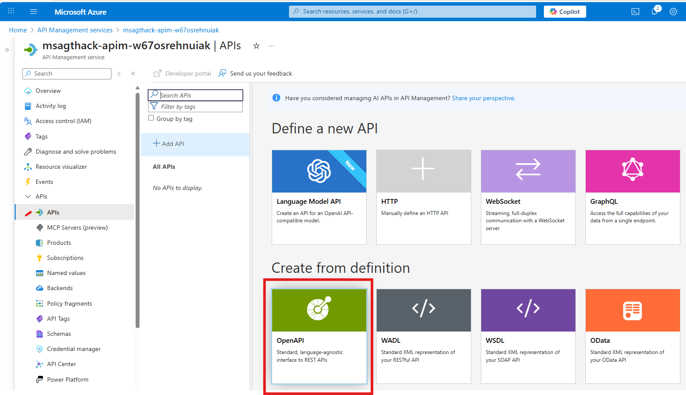
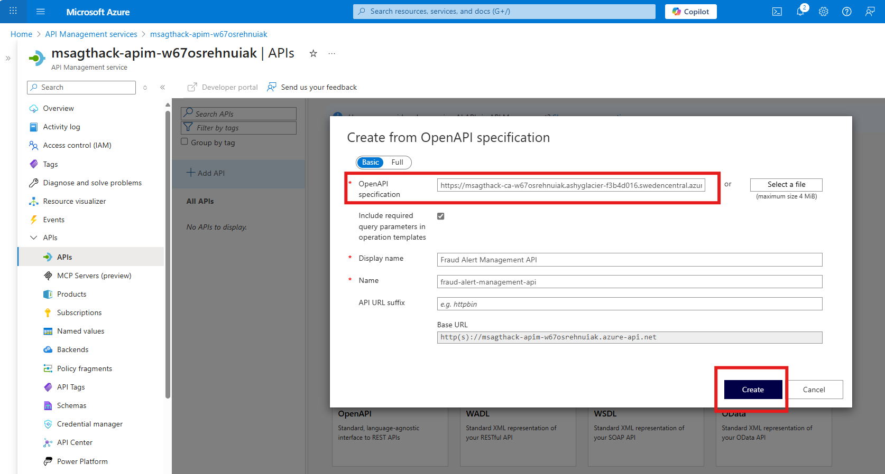
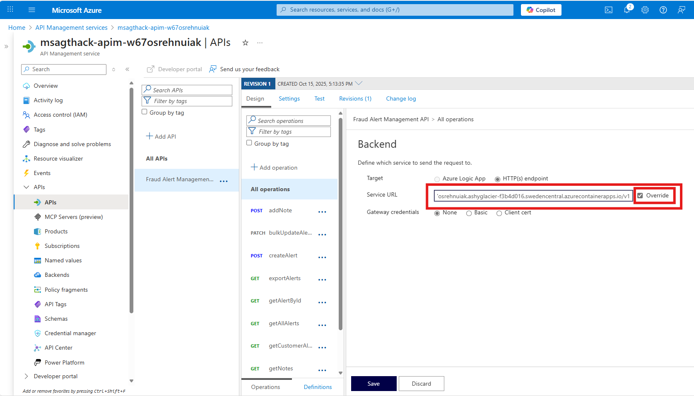
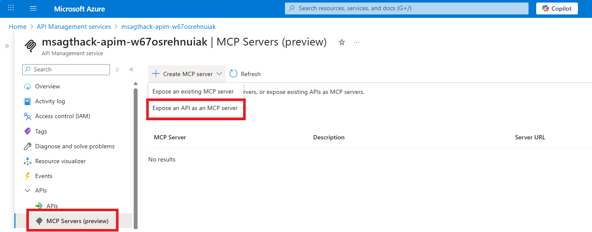

# Challenge 2: MCP Server Integration in Agent Framework

**Expected Duration:** 60 minutes

This challenge focuses on integrating a Fraud Alert Manager API as  Model Context Protocol (MCP) server using Azure API Management. This MCP server will then be connected to an agent, enabling the agent to leverage fraud alert capabilities.

We will not implement the fraud alerting logic itself, but rather we will leverage Azure API Management to expose a pre-built fraud detection API as MCP server. Sounds cool, right? No need to write new code, just configure and connect!

## What is MCP?

The Model Context Protocol (MCP) is a standardized way for AI models and systems to communicate context and metadata about their operations. It allows different components of an AI ecosystem to share information seamlessly, enabling better coordination and integration.

The Model Context Protocol enables, in this case, leverage fraud alert systems to be integrated with other agents, enhancing their capabilities and responsiveness:

- **Real-time alerts**: Immediate notifications when fraud patterns are detected
- **Context sharing**: Rich information exchange between systems
- **Tool orchestration**: Coordinated responses across multiple platforms


## Part 1 - Expose your API as MCP Server with API Management

### Understand the Fraud Alert Manager API

The Fraud Alert Manager API is a pre-built service that simulates fraud alerting functionalities. It provides endpoints to create, retrieve, and manage fraud alerts. This service is hosted on Azure Container Apps and has been pre-configured and deployedfor this challenge.

Before we start, familiarize yourself with the API documentation provided by the Swagger UI at your Container Apps URL:

```
RG=<your_resource_group_name>
CONTAINER_APP=$(az containerapp list --resource-group $RG --query "[0].name" -o tsv)
CONTAINER_APP_URL=$(az containerapp show --name $CONTAINER_APP --resource-group $RG --query properties.configuration.ingress.fqdn -o tsv)
echo "Swagger UI URL: http://$CONTAINER_APP_URL/v1/swagger-ui/index.html"
```

### Onboard you API to Azure API Management

1. **Import the Fraud Alert Manager API**:
   - Navigate to your API Management instance in the Azure portal.
   - Go to the "APIs" section and select "Add API".
   - Choose "OpenAPI"
   
   - Provide the URL to the Swagger JSON of the Fraud Alert Manager API, which can be found at:
   ```bash
   echo http://$CONTAINER_APP_URL/v1/v3/api-docs
   ```
   
   - Click "Create".

2. **Modify settings and validate the API has been imported successfully**:
   - Modify backend endpoint to point to the Fraud Alert Manager API.
   ```bash
   echo http://$CONTAINER_APP_URL/v1
   ```
   
   
   - Test API operations in the Azure portal to ensure everything is working correctly. For instance, get all alerts as shown in the video:
   

### Create MCP Server from your API

I will go straight to how to create an MCP server from your API. I encourage you to explore more about this in the [official doc](https://learn.microsoft.com/en-us/azure/api-management/export-rest-mcp-server).

1. **Navigate to the MCP Servers section**:
   - Under "APIs", click on "MCP Servers (Preview)".
   - Click "Create MCP Server" and "Expose an API as MCP Server"
   

2. **Select the API and operations to expose**:
   - Select API, operations and provide details as shown below:
    
   - Click "Create".

Finally, save the "MCP Server URL" of the newly created MCP server, you will need it in the next part. Add a new entry with the value in the '.env' file:
```bash
MCP_SERVER_ENDPOINT=<MCP_SERVER_URL>
```

## Part 2 - Connect an Agent to your Alert MCP Server

First, have a look at the Agent Framework documentation on how to use [MCP servers](https://learn.microsoft.com/en-us/agent-framework/user-guide/model-context-protocol/using-mcp-tools?pivots=programming-language-python)

### Option 1: Use the MCP server from a ChatAgent (Agent Framework)

### Define the MCP as a Tool in the Agent

Now, it is time to configure a simple ChatAgent that uses the MCP server. 

The agent has been implemented for you in the `challenge-2/agents/fraud_alert_agent.py` file.

We have left a placeholder in the code so you can add the MCP server as a tool. In line 99, find:

```python
            tools= < PLACEHOLDER FOR MCP TOOLS >
```

Replace it by:

```python
            tools=MCPStreamableHTTPTool(
                name="Fraud alert manager MCP",
                url=mcp_endpoint,
                load_prompts=False,
                headers={
                    "Ocp-Apim-Subscription-Key": mcp_subscription_key
                },
            ),
```

A few things here: 
- The kind of tool is (MCPStreamableHTTPTool)(https://learn.microsoft.com/en-us/agent-framework/user-guide/model-context-protocol/using-mcp-tools?pivots=programming-language-python#mcpstreamablehttptool)
- load_prompts is set to False because API Management exposed MCP server does not serve prompts.
- The subscription key header is required to authenticate against the API Management instance. Good stuff if you want to control access to your MCP server!

### Run the Agent

To validate that the final Fraud Alert API is receiving requests from the agent, you can monitor the logs of the Container App hosting the Fraud Alert Manager API. In the terminal, run:

```bash
az containerapp logs show --name $CONTAINER_APP --resource-group $RG --follow
```

Now, run the agent in another terminal:

```bash
cd agents
python fraud_alert_agent.py
```

See output on both terminals. You should see the agent sending requests to the Fraud Alert Manager API and receiving responses.

### Option 2: Use the MCP from a Azure Foundry Agent Service

You can also use the MCP server from an Azure Foundry Agent Service.

The agent has been implemented for you in the `challenge-2/agents/fraud_alert_foundry_agent.py` file.

We have left a placeholder in the code so you can add the MCP server as a tool. In line 29, find:

```python
mcp_tool = < PLACEHOLDER FOR MCP TOOL >
```

Replace it by:

```python
mcp_tool = McpTool(
    server_label="fraudalertmcp", 
    server_url=mcp_endpoint,
)
mcp_tool.update_headers("Ocp-Apim-Subscription-Key",
                        mcp_subscription_key)
```

A few things here:
- The kind of tool is [McpTool](https://learn.microsoft.com/en-us/azure/ai-foundry/agents/how-to/tools/model-context-protocol-samples?pivots=python#create-an-agent-with-the-mcp-tool)
- The subscription key header is required to authenticate against the API Management instance. Good stuff if you want to control access to your MCP server!

### Run the Agent 

Same as with option 1, to validate that the final Fraud Alert API is receiving requests from the agent, you can monitor the logs of the Container App hosting the Fraud Alert Manager API. In the terminal, run:

```bash
az containerapp logs show --name $CONTAINER_APP --resource-group $RG --follow
```

Now, run the agent in another terminal:

```bash
cd agents
python fraud_alert_foundry_agent.py
```

See output on both terminals. You should see the agent sending requests to the Fraud Alert Manager API and receiving responses.

Also, you can monitor the agent service in the Azure portal to see the conversations and tool usage.

